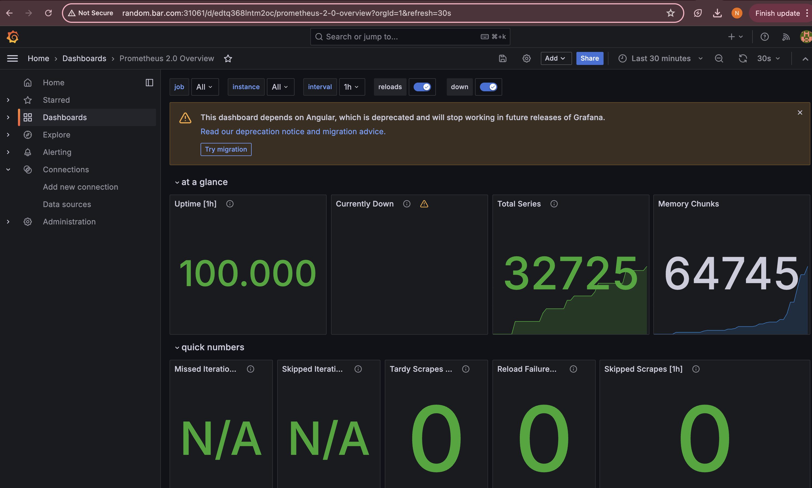
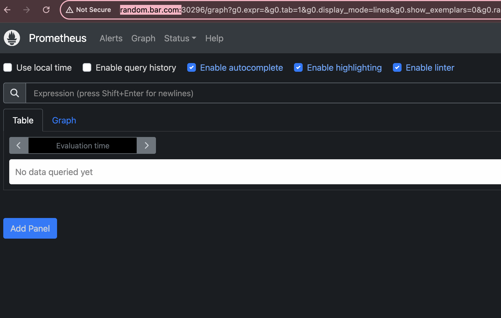
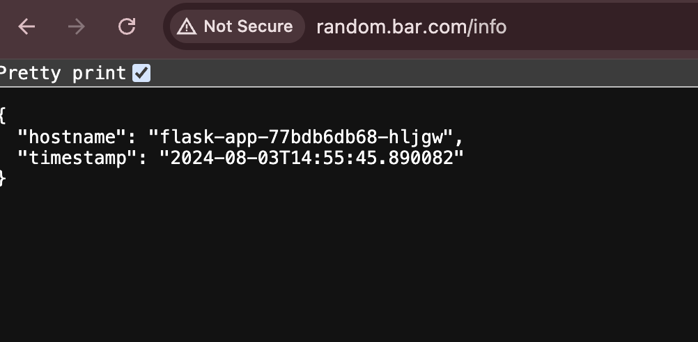

# Flask Project with Docker and Kubernetes

This project uses Flask to respond to an HTTP GET request and returns the following information:
- **Timestamp**
- **Hostname**

**Endpoint:** `http://<host-dns>/info`

## Prerequisites

- Docker
- Kubernetes (Minikube recommended for local testing)
- Python 3.9

## Detailed Instructions on How to Build the Application

### 1. Navigate to the Project Directory
```shell
cd /path/to/Project
```
### 2. Build the Docker Image and Push to Docker Hub
a. Build the Docker image:
```shell
docker build -t <your-dockerhub-username>/<image-name>:latest .
```
b. Log in to Docker Hub (if not already logged in):
```shell
docker login
```
c. Push the Docker image to Docker Hub:
```shell
docker push <your-dockerhub-username>/<image-name>:latest
```
### 3. Update Kubernetes Files
a. Update deployment.yaml:

i. Change the image name to the one defined above:
```yaml
containers:
  - name: flask-app-container
    image: <your-dockerhub-username>/<image-name>
```
ii. Add Basic Authentication (Optional):
Base64 encode your username and password. The default username/password is user/user:
Update AUTH_USER and AUTH_PASSWORD in deployment.yaml secrets section:
```yaml
data:
  AUTH_USER: base64_encoded_username
  AUTH_PASSWORD: base64_encoded_password
```
b. Update ingress.yaml:

Change the host to your preferred DNS:
```yaml
rules:
  - host: <your-preferred-host-dns>
 ```
### 4. Apply the Kubernetes Configurations
Ensure you are in the directory containing your Kubernetes configuration files.
```shell
kubectl apply -f k8s/deployment.yaml
kubectl apply -f k8s/service.yaml
kubectl apply -f k8s/ingress.yaml
```
Note: Make sure you have an Nginx controller.

### 5. Access the Application
The application should be available at:
```sh
http://<your-preferred-host-dns>/info
```

## Testing the Code with Minikube
For testing the deployment using Minikube, follow the same steps above. Additionally, map the Minikube Node IP to the DNS provided in /etc/hosts.

1. Start Minikube
```sh
minikube start
```
2. Get Minikube IP
```sh
minikube ip
```
3. Map Minikube IP to DNS
Open /etc/hosts and add an entry mapping the Minikube IP to your preferred DNS:
```sh
sudo nano /etc/hosts
```
Add the line:
```plaintext
<minikube-ip> <your-preferred-host-dns>
```
4. Access the Application
You should be able to access the application at:
```sh
http://<your-preferred-host-dns>/info
```
Make sure you have enabled ingress before running scripts.
```sh
minikube addons enable ingress
```
## Stretch Goals
I have set up Prometheus and Grafana in Minikube. Use the following commands to install and expose these services:

Install Prometheus and Grafana
```sh
helm repo add prometheus-community https://prometheus-community.github.io/helm-charts
helm repo add grafana https://grafana.github.io/helm-charts
helm repo update
helm install prometheus prometheus-community/prometheus
helm install grafana grafana/grafana
```
Expose Prometheus and Grafana Services
```sh
kubectl expose service prometheus-server --type=NodePort --target-port=9090 --name=prometheus-server-ext
kubectl expose service grafana --type=NodePort --target-port=3000 --name=grafana-ext
kubectl expose service prometheus-kube-state-metrics --type=NodePort --target-port=8080 --name=prometheus-kube-state-metrics-ext
```
Access Grafana and Create Dashboard:

After accessing Grafana, add Prometheus as a data source and update the Prometheus server URL. You can get the port by running "kubectl get svc" and look for service prometheus-server-ext.
Create a dashboard by importing dashboard and loading 3662. You can also create your custom dashboard. 

Update Prometheus Configuration
Update the scrape_configs in the Prometheus configuration to include kube-state-metrics:
```sh
kubectl edit cm prometheus-server
```
Under scrape_configs, add:
```yaml
- job_name: state-metrics
  static_configs:
    - targets:
      - localhost:<port of the state metric fetched from kubectl get svc>
```
In the future, any metrics can also be exposed using the above steps.

Added Screen Shot of the outputs
1. Grafana
```markdown

```
2. Prometheus
```markdown

```
3. Application on Browser
```markdown

```
